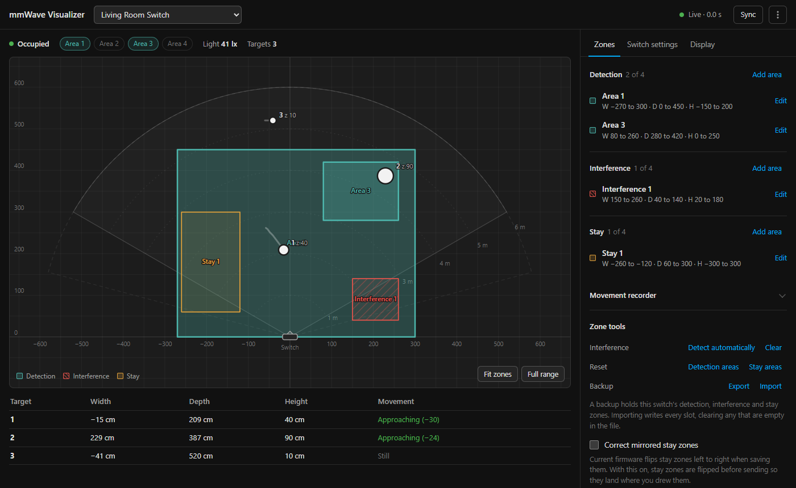
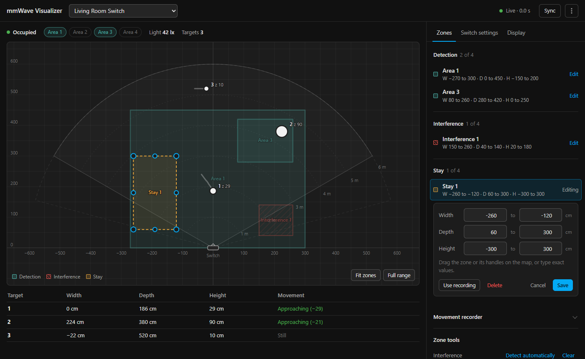
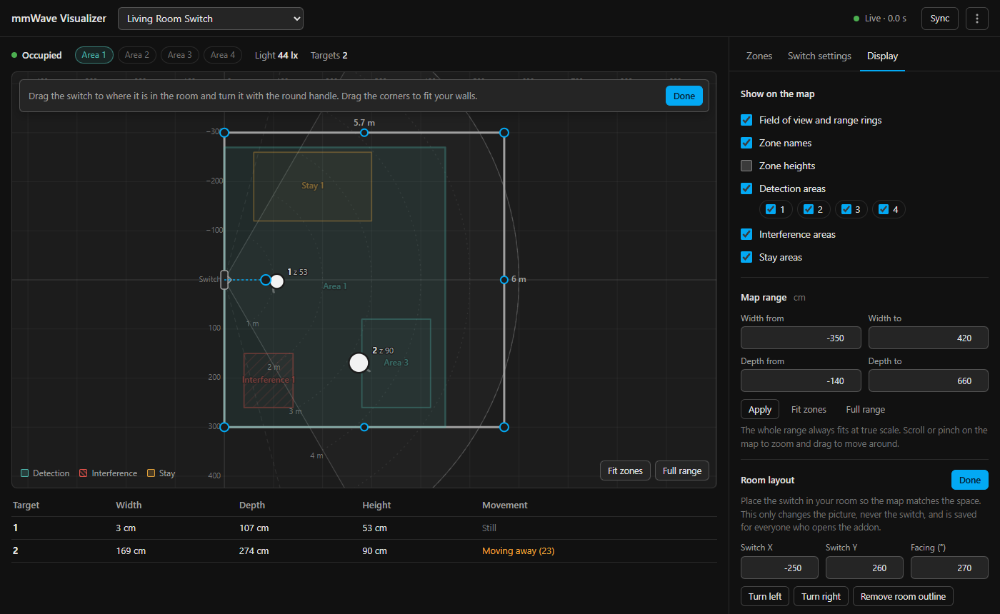
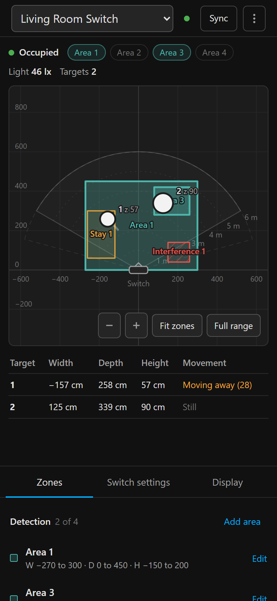

# Inovelli mmWave Visualizer for Z2M and ZHA(Experimental)

**Live 2D presence tracking and zone configuration for Inovelli mmWave Smart Switches in Home Assistant.**

[](https://my.home-assistant.io/redirect/supervisor_add_addon_repository/?repository_url=https%3A%2F%2Fgithub.com%2Fnickduvall921%2Fmmwave_vis)

## Screenshots

| Live tracking | Editing a zone |
|---|---|
|  |  |
| **Room layout** | **On a phone** |
|  |  |

## Overview

Decodes Zigbee2MQTT payloads to visualize real-time MQTT data and configure detection, interference, and stay zones via MQTT commands. The radar overlay reflects the sensors actual field of view (120°–150°) with range arcs at 1m intervals up to 6m.

ZHA support has just been added experimentally. Requires a custom Quark that I have built to be installed in ZHA.
[ZHA DOC HERE](ZHADOC.md)

> **ZHA on Home Assistant 2026.8 or later:** keep (or install) this repo's quirk even though ZHA now supports the VZM32-SN on its own. The built-in support doesn't pass the switch's radar reports on to Home Assistant, so without this quirk the Visualizer shows nothing. [Why](ZHADOC.md#why-the-custom-quirk-is-still-needed)

## Features

- Live map of everyone the switch is tracking, with short trails and the sensor's field of view.
- Draw and resize detection, interference and stay zones on the map, or type exact width, depth and height values. Up to four of each.
- Room layout: place the switch on the right wall, turn it the way it faces and draw your walls, so the map looks like your room. It's saved in the addon, so every phone and computer sees the same layout.
- Movement recorder: walk an area, then fit a zone around where you walked.
- Auto-detect and clear interference zones (fans, vents, curtains).
- Back up a switch's zones to a file and restore them after a reset or re-pair (Zone tools, then Backup).
- Undo: take back a zone save or delete, a clear, a reset, an auto-detect or a backup import (Undo bar in the Zones tab, or Ctrl+Z).
- Name zones ("Couch", "Desk"); the names show on the map, in the zone list and in backups. Each detection area shows its Home Assistant entity, or on ZHA a ready-made sensor to copy.
- History (off until you turn it on): a heat map of where people spent time over the last 10 minutes, hour, 6 hours, day, week or any range, and a timeline of when occupancy and the light changed, each with a replay of what the radar saw.
- Hold time and sit-still tests that time how the switch behaves and suggest what to change.
- Switch details: firmware, mmWave module version, Zigbee signal and firmware updates.
- Download diagnostics from the ⋮ menu to attach to a bug report (passwords and tokens are removed).
- Occupancy, per-area occupancy and light level as they change.
- Works on phones, follows your light or dark system theme, and saves the map as an image from the ⋮ menu.

## Installation

Two install paths are supported from the same codebase:

- **Home Assistant Addon** — Recommended if you run Home Assistant. Integrates with the Supervisor, uses ingress, and picks up the `SUPERVISOR_TOKEN` automatically for ZHA mode.
- **Standalone Docker** — For users running Zigbee2MQTT in Docker or on a separate machine from Home Assistant.

### Home Assistant Addon

#### Quick Install

Click the button below to add this repository to your Home Assistant instance:

[](https://my.home-assistant.io/redirect/supervisor_add_addon_repository/?repository_url=https%3A%2F%2Fgithub.com%2Fnickduvall921%2Fmmwave_vis)

#### Manual Install

1. Navigate to **Settings → Add-ons** in your Home Assistant dashboard.
2. Click the **Add-on Store** button (bottom right).
3. Click the **three dots (⋮)** in the top right and select **Repositories**.
4. Paste this URL and click **Add**:
   ```
   https://github.com/nickduvall921/mmwave_vis
   ```
5. Close the dialog. **Inovelli mmWave Visualizer** will appear at the bottom of the Add-on Store.

### Standalone Docker

A pre-built multi-arch image (linux/amd64, linux/arm64) is published to GitHub Container Registry on every release:

```
ghcr.io/nickduvall921/mmwave_vis:latest
```

#### 1. Create a `docker-compose.yml`

```yaml
services:
  mmwave-visualizer:
    image: ghcr.io/nickduvall921/mmwave_vis:latest
    container_name: mmwave_vis
    ports:
      - "5000:5000"
    volumes:
      - ./mmwave_data:/data         # Keeps room layouts across updates
    environment:
      - ZIGBEE_STACK=z2m
      - MQTT_BROKER=192.168.1.XX    # Change to your broker IP
      - MQTT_PORT=1883
      - MQTT_USERNAME=              # Optional
      - MQTT_PASSWORD=              # Optional
      - MQTT_BASE_TOPIC=zigbee2mqtt
    restart: unless-stopped
```

#### 2. Start the container

```bash
docker compose up -d
```

#### 3. Open the UI

Navigate to `http://<your-ip>:5000`.

#### Environment Variables

| Variable | Description | Default |
|---|---|---|
| `ZIGBEE_STACK` | `z2m` or `zha` | `z2m` |
| `MQTT_BROKER` | MQTT broker host | `core-mosquitto` |
| `MQTT_PORT` | MQTT broker port | `1883` |
| `MQTT_USERNAME` | MQTT username | `""` |
| `MQTT_PASSWORD` | MQTT password | `""` |
| `MQTT_BASE_TOPIC` | Zigbee2MQTT base topic (also accepts `Z2M_BASE_TOPIC`) | `zigbee2mqtt` |
| `MQTT_USE_TLS` | Enable TLS/SSL | `false` |
| `MQTT_TLS_INSECURE` | Skip cert verification (not recommended) | `false` |
| `MQTT_TLS_CA_CERT` | Path to custom CA certificate file | `""` |
| `HA_URL` | Home Assistant URL (ZHA mode only) | `http://supervisor` |
| `HA_TOKEN` | Long-lived access token (ZHA mode only) | `""` |
| `DEBUG` | Verbose logging | `false` |

#### TLS/SSL

To connect to a TLS-enabled broker (e.g. on port 8883):

```yaml
environment:
  - MQTT_BROKER=your-broker
  - MQTT_PORT=8883
  - MQTT_USE_TLS=true
```

For self-signed certificates, mount your CA cert and reference it:

```yaml
volumes:
  - ./mmwave_data:/data
  - ./ca.crt:/data/ca.crt

environment:
  - MQTT_USE_TLS=true
  - MQTT_TLS_CA_CERT=/data/ca.crt
```

> ⚠️ `MQTT_TLS_INSECURE=true` disables all certificate verification. Only use this on trusted local networks — it defeats the purpose of TLS.

> **Migrating from `mmWave_vis_docker`?** The image path has changed from `ghcr.io/nickduvall921/mmwave_vis_docker:main` to `ghcr.io/nickduvall921/mmwave_vis:latest`. The legacy `Z2M_BASE_TOPIC` env var is still accepted as a fallback, but `MQTT_BASE_TOPIC` is preferred.

## Configuration(Z2M)

Before starting the add-on, go to the **Configuration** tab and connect it to your MQTT broker.

| Option | Description | Default |
|--------|-------------|---------|
| `mqtt_broker` | Hostname of your MQTT Broker | `core-mosquitto` |
| `mqtt_port` | Broker port | `1883` |
| `mqtt_username` | MQTT username (if applicable) | `""` |
| `mqtt_password` | MQTT password (if applicable) | `""` |
| `mqtt_base_topic` | Base topic for Zigbee2MQTT | `zigbee2mqtt` |

> **Note:** If you use the standard Home Assistant Mosquitto broker add-on, the defaults should work out of the box.

## Switch Setup (Required)(Z2M)

1. Go to your switch's device page in Zigbee2MQTT → **Bind** tab.
2. In the **Clusters** dropdown, add `manuSpecificInovelliMMWave`.
3. Click **Bind**. You should see a green "Bind Success" message.
4. Go to the **Exposes** tab and enable **MmWaveTargetInfoReport**.

> **Note:** Disable Target Info Reporting when not actively using the visualizer, as it generates significant Zigbee network traffic when targets are detected. The visualizer shows a reminder above the map, with a button to turn it back on, if reporting is off.

## Usage

1. Pick your switch from the list at the top. The list can take a moment to fill while the addon waits for the switch to report in. The addon remembers the switch you used last.

2. The map shows people as the switch tracks them. The solid cone is the rated 120° field of view and the dashed lines show the wider ~150° the sensor manages in practice. Scroll (or pinch) to zoom, drag to move around, and use Fit zones or Full range to reset the view.

3. To change a zone, click it on the map or press Edit next to it in the Zones tab. Drag the zone or its handles, or type exact values, then press Save. Add area creates a new one and lets you pick which slot it goes in. Press Sync to read the zones back from the switch.

4. To set up the room layout, open the Display tab and press Arrange on map. Drag the switch to where it is, turn it with the round handle, and add a room outline to draw your walls. This only changes the picture, never the switch.

5. To auto-detect interference, clear the room, turn on whatever moves (fan, vent and so on) and press Detect automatically under Zone tools. Any interference zones the switch finds show up hatched in red.

Settings that change the switch itself are in the Switch settings tab, and they're sent as soon as you change them.

## Understanding the Zones

**Detection areas (teal)** are where the sensor looks. Only motion inside them counts; anything outside is ignored. Each one has its own occupancy sensor (area 1 to 4), and an area lights up on the map while someone is in it.

**Interference areas (red, hatched)** are ignored. Use them to mask things that always move, like ceiling fans or curtains.

**Stay areas (amber)** are more sensitive to people sitting still, for a sofa, bed or desk, so the lights stay on when you barely move.

## Known Limitations

1. **Radar persistence:** The switch does not send an "all clear" when there is no motion. The last tracked target stays on the radar indefinitely after it leaves. Refer to the Occupancy status or packet age to determine if the area is clear.

2. **Slow saves:** A switch can take up to half a minute to apply a zone, and now and then drops one sent close behind another. The map shows the zone dashed until the switch confirms it, sends it again once if it hasn't shown up after 18 seconds, and tells you if the switch never confirms it.

## Known Issues

- Current firmware flips stay areas left to right when saving them. Turn on **Correct mirrored stay zones** under Zone tools and they'll land where you drew them.
- Current firmware stores some zone edges 1 cm lower than entered (105 cm comes back as 104 cm). It makes no practical difference, and the addon allows for it.

Please open an issue on GitHub if you encounter any bugs.

## Red Series (Z-Wave) Testers

Z-Wave switches aren't supported yet. The VZW32-SN reports target positions on firmware 2.04 and later, but Z-Wave JS doesn't pass those frames on to Home Assistant and their format isn't published. If you own a VZW32-SN, **Z-Wave packet capture** in the addon's **⋮** menu (top-right corner) opens a packet capture that records the Z-Wave JS driver log (it works whichever Zigbee stack the addon is set to). Attach the downloaded file to [#42](https://github.com/nickduvall921/mmwave_vis/issues/42) to help get support added.

## Requirements

- Home Assistant OS or Supervised
- [Zigbee2MQTT](https://www.zigbee2mqtt.io/) v2.8.0 or higher (ZHA is not supported)
- At least one Inovelli mmWave Smart Switch

## License

GNU General Public License v3.0